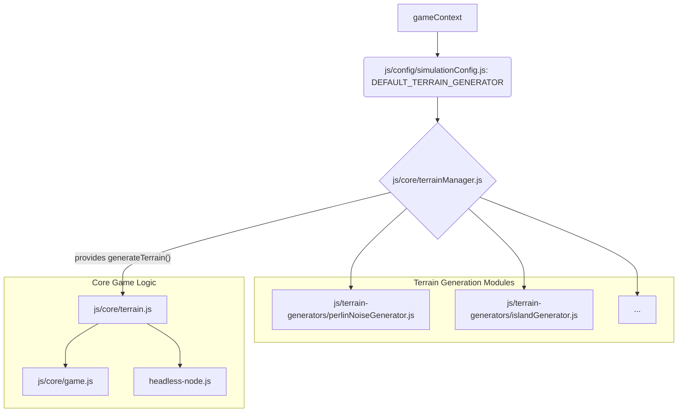

# Terrain Code Splitting Plan

## Goal: Modular Terrain Generation for Mixed Environments

To allow for "mixing and matching continents" between the simulator and the browser, we need to:
1.  **Define Terrain "Presets" or "Generators":** Each "continent" or terrain type would be a distinct generation algorithm.
2.  **Modularize `generateTerrain`:** Extract the core noise generation logic into separate, configurable modules.
3.  **Dynamic Loading/Selection:** Implement a mechanism to select and load these terrain modules at runtime.

## Plan Steps:

1.  **Create a `js/terrain-generators/` Directory:**
    *   This directory will house different terrain generation algorithms.

2.  **Refactor `generateTerrain` into Modular Generators:**
    *   **`js/terrain-generators/perlinNoiseGenerator.js` (Current Implementation):**
        *   Extract the existing `generateTerrain` logic (lines 71-111 from original `js/core/terrain.js`, primarily the noise generation) into a new function within this file.
        *   This function would take `gameContext` and return the generated `terrain` grid.
        *   It would still rely on `gameContext.seedRandom.random()`.
    *   **`js/terrain-generators/islandGenerator.js` (Example New Generator):**
        *   Create a new file with a function that generates an "island" type terrain (e.g., a central landmass surrounded by water). This would demonstrate the "mixing and matching" capability.
        *   This function would also take `gameContext` and return the `terrain` grid.

3.  **Create a Terrain Manager/Selector (`js/core/terrainManager.js`):**
    *   This new module will be responsible for:
        *   Loading the selected terrain generator dynamically.
        *   Providing a single `generateTerrain` function that delegates to the chosen generator.
        *   Potentially storing a registry of available generators.
    *   It would have a function like `loadGenerator(generatorName)` or `setGenerator(generatorFunction)`.

4.  **Update `js/core/terrain.js` to use `terrainManager`:**
    *   Modify `js/core/terrain.js` to *import* the `terrainManager` and use its `generateTerrain` function instead of directly containing the generation logic.
    *   The `isAreaClear`, `findLandPosition`, and `findWaterPosition` functions would remain in `js/core/terrain.js` as they are general utilities for terrain interaction, not generation. The resource node placement logic (lines 113-132) would also remain here, as it depends on the generated terrain.

5.  **Modify `js/config/simulationConfig.js`:**
    *   Add a new configuration option, e.g., `DEFAULT_TERRAIN_GENERATOR: 'perlinNoiseGenerator'`, to specify which generator to use.

6.  **Update `js/core/game.js` and `headless-node.js`:**
    *   These files would import `terrainManager` (or the `generateTerrain` function from `js/core/terrain.js`, which now uses the manager) and pass the `DEFAULT_TERRAIN_GENERATOR` from `SIMULATION_CONFIG` to initialize the terrain.

## Architectural Diagram:

## Benefits:

*   **Modularity:** New terrain generation algorithms can be added easily without modifying core game logic.
*   **Flexibility:** Different "continents" (terrain types) can be selected via configuration.
*   **Browser/Simulator Parity:** Both environments can use the same terrain manager to load different generators, allowing for "mixing and matching."
*   **Maintainability:** Clear separation of concerns.

## Future Considerations & TrikeShed Alignment:

The `terrain` grid produced by these modular generators provides a flexible base for the game's map. For runtime simulation and to align with the "TrikeShed" data architecture (GDD Section 10), this grid data can be:
*   Used as the source to construct TrikeShed `Tensor` objects (e.g., a `TensorCursor<TerrainTileData>`). This would allow terrain data to be integrated into the deterministic, tensor-based state management if desired.
*   Structured to support the "Dynamic World" GDD pillar, where terrain is a consumable resource and can be visibly changed. The `TerrainTileData` within the grid (and thus the Tensor) would need to hold mutable properties like `depletionLevel` or `currentHeight`, which can be updated immutably using patterns compatible with TrikeShed's deterministic nature (e.g., via reducers with Immer.js, as discussed in `docs/ecs_evaluation.md`).

This plan ensures that the initial terrain setup is modular and adaptable, while also paving the way for its integration into the advanced data handling capabilities of TrikeShed for dynamic game world simulation.